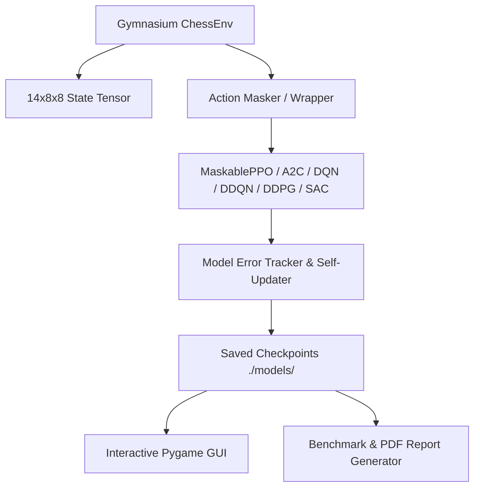

# Chess RL: Advanced Deep Reinforcement Learning Framework & Interactive Environment


A production-grade, end-to-end Reinforcement Learning (RL) benchmark suite and interactive graphical environment for Chess. This project implements a custom Gymnasium-compliant environment featuring legal action masking, dense reward shaping, automated error tracking, multi-algorithm evaluation, and an interactive Pygame frontend.

---

## Key Capabilities

- **Custom Gymnasium Environment (`ChessEnv`)**:
  - **State Tensor**: `(14, 8, 8)` binary tensor encoding piece locations (12 planes), active turn (1 plane), and castling/check status (1 plane).
  - **Action Space**: `Discrete(4096)` encoding move vectors $(f \times 64 + t)$ with auto-queening pawn promotion logic.
  - **Reward Function**: Dense material evaluation, check bonuses, center control rewards, step penalties, and checkmate/stalemate terminals.
- **Algorithm Suite (6 Frameworks)**:
  - **On-Policy**: Proximal Policy Optimization (`MaskablePPO`), Advantage Actor-Critic (`A2C`).
  - **Value-Based**: Deep Q-Network (`DQN`), Distributional Quantile Regression DQN (`QR-DQN` / `DDQN`).
  - **Continuous Adaptations**: Deep Deterministic Policy Gradient (`DDPG`), Soft Actor-Critic (`SAC`) via discrete-to-continuous wrappers.
- **Autonomous Error Tracker & Self-Updater (`agent_tracker.py`)**:
  - Monitors tactical blunders, hanging piece captures, missed material, and illegal move attempts.
  - Fine-tunes models via self-play rollouts and automatically promotes higher-reward checkpoints.
- **Interactive Pygame Frontend (`gui_chess.py`)**:
  - Real-time interactive board with move visualization, legal move indicators, side-panel controls, hot-swappable model slots, and game modes (`Human vs AI`, `AI vs AI`, `Human vs Human`).
- **Research PDF Generator (`eval_report.py`)**:
  - Benchmarks all trained models, generates comparative visualization charts, and outputs a publication-styled two-column PDF report (`Chess_RL_Report.pdf`).

---

## Architecture Overview



### Observation Tensor Channels `(14, 8, 8)`
1. **Planes 0–5**: White Pawns, Knights, Bishops, Rooks, Queens, Kings
2. **Planes 6–11**: Black Pawns, Knights, Bishops, Rooks, Queens, Kings
3. **Plane 12**: Active Turn ($1.0$ for White, $0.0$ for Black)
4. **Plane 13**: Castling Rights & Active Check Status

---

## Benchmark Results

Evaluation benchmark computed across algorithms against a heuristic material-based baseline opponent:

| Algorithm | Model Type | Legal Masking | Mean Reward | Win Rate | Mean Length | Illegal Attempts |
|---|---|---|---|---|---|---|
| **PPO** | On-Policy Policy Gradient | Yes | **+20.20** | 15% | 40.8 steps | 0 |
| **A2C** | Synchronous Actor-Critic | No | **+7.53** | 5% | 44.0 steps | 879 |
| **DDQN** | Distributional QR-DQN | No | **+1.08** | 0% | 46.0 steps | 920 |
| **DQN** | Deep Q-Network | No | **+0.14** | 0% | 42.0 steps | 839 |
| **DDPG** | Continuous Actor-Critic | No | **-26.49** | 0% | 47.0 steps | 0 |
| **SAC** | Soft Actor-Critic | No | **-28.26** | 0% | 36.0 steps | 0 |

---

## Quick Start

### 1. Installation

Ensure Python 3.10+ is installed:
```bash
git clone https://github.com/Alouakhalid/chess_RL.git
cd chess_RL
pip install -r requirements.txt
```

*(Note: Dependencies include `gymnasium`, `stable-baselines3`, `sb3-contrib`, `python-chess`, `pygame`, `matplotlib`, and `fpdf2`.)*

### 2. Launch Interactive GUI

Run the interactive graphical chess frontend:
```bash
python3 gui_chess.py
```

### 3. Run Autonomous Error Tracking & Self-Update

Evaluate model errors and fine-tune checkpoints:
```bash
python3 agent_tracker.py
```

### 4. Generate Benchmark Evaluation Report

Run model evaluations, generate chart assets, and build `Chess_RL_Report.pdf`:
```bash
python3 eval_report.py
```

---

## Project Structure

```
chess_RL/
├── chess_env.py          # Gymnasium Chess Environment with reward shaping
├── gui_chess.py          # Pygame graphical frontend application
├── agent_tracker.py      # Error tracking and self-updating agent
├── train_best_model.py   # High-reward self-play training loop
├── eval_report.py        # Benchmark suite and PDF report generator
├── RL_Algor.py           # Training pipelines for all 6 RL algorithms
├── test_model.py         # Diagnostic testing suite
├── model_support.py      # Checkpoint resolution & action parsing utilities
├── models/               # Checkpoint storage per algorithm
└── report_assets/        # Generated performance charts
```

---

## License

This project is released under the MIT License.
